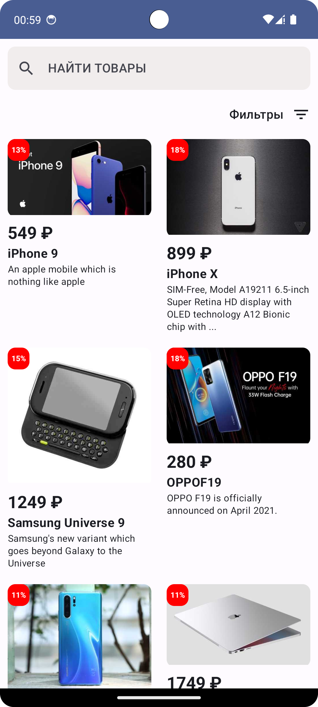

# MarketPlace Android Application
---
Простое Android-приложение позволяющее просматривать товары.

## Содержание

1. [Задача](#задача)
2. [Функциональность](#функциональность)
3. [Требования](#требования)
4. [Используемые технологии](#используемые-технологии)
5. [API](#api)
6. [Начало работы](#начало-работы)
7. [Как использовать](#как-использовать)
8. [Скриншоты](#скриншоты)

## Задача

Разработать мобильное приложение для просмотра товаров с возможностью детального просмотра каждого товара. Приложение должно получать данные о товарах с помощью API и предоставлять удобный интерфейс для их просмотра.

## Функциональность

- Просмотр списка всех товаров.
- Поиск определенных товаров.
- Просмотр категорий товаров.
- Просмотр товаров по выбранным категориям.
- Детальный просмотр каждого товара с отображением всех изображений товара.
- Получение данных о товарах с использованием Retrofit.
- Управление зависимостями с помощью Hilt-Dagger.
- Отображение изображений товаров с помощью Glide.
- Использование Jetpack Compose для построения пользовательского интерфейса.
- Обновление данных в реальном времени с использованием StateFlow.

## Требования

- Android устройство с версией Android 5.0 (API уровень 24) и выше.
- Стабильное интернет-соединение.

## Используемые технологии

- Kotlin
- Hilt-Dagger
- Retrofit
- Glide
- Jetpack Compose
- StateFlow

## API

Базовый URL: `https://dummyjson.com/products`

Query параметры:
- `limit`: количество товаров в одном запросе.
- `total`: общее количество товаров.
- `skip`: количество товаров, которые нужно пропустить в начале списка.

URL для поиска товаров: `https://dummyjson.com/products/search`

Query параметры:
- `limit`: количество товаров в одном запросе.
- `total`: общее количество товаров.
- `skip`: количество товаров, которые нужно пропустить в начале списка.
- `q`: наименование товара.

URL для получения товаров по категориям: `https://dummyjson.com/products/category/{categoryName}`

URL для поиска категорий товаров: `https://dummyjson.com/products/search`

## Начало работы

1. Клонируйте репозиторий на свой компьютер.
```bash
git clone https://github.com/kroshkaenot1/Marketplace_VK.git
```
2. Откройте проект в вашей среде разработки.
3. Убедитесь, что все зависимости установлены с помощью Gradle.

## Как использовать

1. Запустите приложение на своем Android устройстве или эмуляторе.
2. Перейдите на главный экран приложения, чтобы просмотреть список товаров.
3. Нажмите на товар, чтобы просмотреть его детальную информацию и изображения.
4. Воспользуйтесь поиском для поиска необходимых товаров.

## Скриншоты

Точка старта приложения - экран со списком товаров




Для детального просмотра необходимо нажатием перейти к карточке товара


Также можно воспользоваться поиском товаров


Доступно отображение товаров по фильтру категорий

